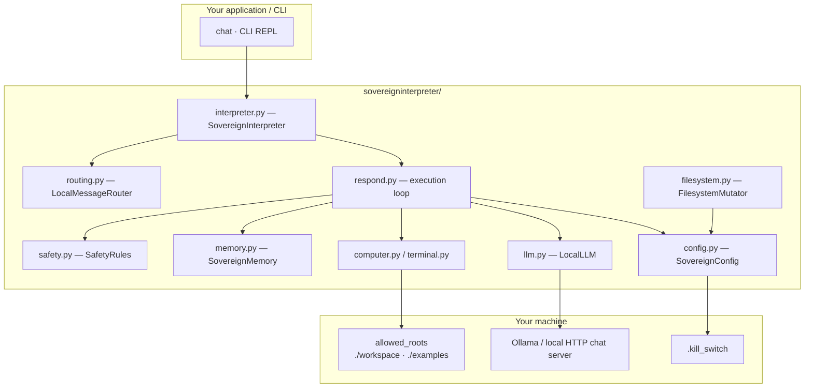
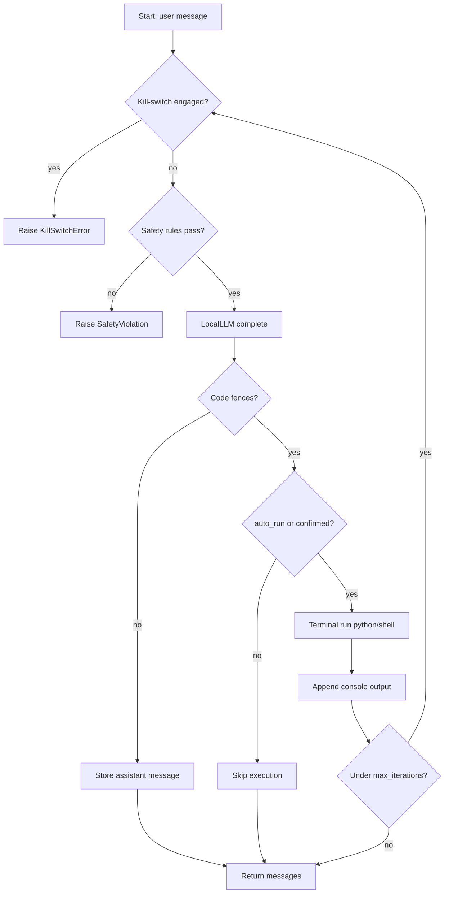

# SovereignInterpreter

Local-first **code execution** that keeps inference, files, and shell/python runs on your machine.

Familiar chat → code → console ergonomics from an upstream interpreter framework (original reference implementation / local execution system (upstream)) — rebuilt for offline use, privacy controls, and sovereign safety doctrine.

**Maintained by MatteBlackStudios**

> **Independence notice:** This project is an independent fork of an upstream interpreter framework (also described as the original reference implementation / local execution system (upstream)). It is not affiliated with, endorsed by, or sponsored by any organization. All cloud dependencies have been removed.

---

## Why SovereignInterpreter Exists

The upstream interpreter framework showed that natural-language chats that emit and run code are a powerful operator model.

What it did not prioritize was **sovereignty**:

- Inference that never leaves your network by default
- A hard stop (kill-switch) when something goes wrong
- Local embeddings and memory packs instead of hosted stores
- Safety rules that block cloud exfiltration patterns
- A filesystem sandbox and confirmation-gated execution
- Zero cloud SDKs or remote message brokers

SovereignInterpreter keeps the chat→code→console mental model and adds only the controls required to run a local execution system as infrastructure you own.

---

## What’s Different

| Upstream interpreter framework | SovereignInterpreter |
|--------------------------------|----------------------|
| Cloud LLM providers and SDKs | Ollama-native `LocalLLM` over plain HTTP |
| Cloud / multi-provider routing | Local-only URL gate (`allow_cloud: false`) |
| Soft offline guidance | Enforced kill-switch, safety rules, confirmation |
| Broad OS computer API | Focused `Computer` + `Terminal` (python/shell) + FS sandbox |
| Hosted memory | `LocalEmbeddings` + `SovereignMemory` / `MemoryPack` |

You still write:

```python
from sovereigninterpreter import SovereignInterpreter

si = SovereignInterpreter()
si.auto_run = True  # local risk accepted
si.chat("Print hello from python")
```

---

## Sovereign Doctrine

| Doctrine | Meaning |
|----------|---------|
| **Privacy first** | `allow_cloud: false` blocks non-local LLM URLs |
| **Offline-capable** | Default endpoint is `http://127.0.0.1:11434/v1` (Ollama-native) |
| **Kill-switch** | Create `.kill_switch` to halt chats and filesystem ops immediately |
| **Allowed-roots sandbox** | `FilesystemMutator` may only touch configured directories |
| **Confirmation gate** | `auto_run: false` by default — code requires approval |
| **Turn / iteration ceiling** | `max_turns` / `max_iterations` bound execution loops |
| **Safety rules** | Local patterns block cloud API hosts, secret-like tokens, and destructive shells |
| **Memory pack hooks** | `SovereignMemory.export_pack()` / `import_pack()` for portable local recall |

These are enforced in code — not documented as suggestions.

---

## Architecture Overview



**Text description:** Your application or CLI calls `chat` or the REPL. The interpreter uses config, local LLM, computer/terminal, memory, and safety modules. The LLM client talks to a local model server; filesystem and code runs stay under policy; the kill-switch file can halt activity.

---

## Sovereign Execution Loop (`chat`)



**Text description:** Each turn checks the kill-switch, runs safety checks, calls the local LLM, optionally confirms and executes code, stores console output, and continues until no more code or `max_iterations` is reached.

---

## Quickstart

### 1. Install

Python 3.10+

```shell
pip install -e ".[dev]"
```

### 2. Start a local model server

```shell
ollama serve
ollama pull llama3.2
```

### 3. Run your first chat

```python
from sovereigninterpreter import SovereignInterpreter

si = SovereignInterpreter()
si.auto_run = True  # approve all code locally for this session
history = si.chat("Compute 2 + 2 in python and print the result.")
print(history[-1])
```

### 4. CLI REPL

Launch with either:

```shell
sovereigninterpreter
# or
python -m sovereigninterpreter
```

Do **not** use `python -m sovereign interpreter` (space) or `python -m SovereignInterpreter` (wrong module name).

Input is plain stdin (keyboard / pipe). Ctrl-C or EOF exits cleanly.
Set `NO_COLOR=1` to disable decorative ANSI colors; labels remain text-only.
Use `--auto-run` only when you accept local execution risk.

REPL helpers:
- Magic: `%reset`, `%auto_run on|off`, `%model [name]`, `%models`
- Shell shortcut: `!ls` runs a local shell command without calling the model

---

## Configuration (`sovereign.yaml`)

```yaml
allow_cloud: false
kill_switch: true
kill_switch_path: .kill_switch
default_model: llama3.2
llm_base_url: http://127.0.0.1:11434/v1
max_turns: 20
max_iterations: 10
auto_run: false
allowed_roots:
  - ./workspace
  - ./examples
redact_patterns: []
```

Environment overrides:

| Variable | Effect |
|----------|--------|
| `SOVEREIGN_CONFIG` | Path to YAML config |
| `SOVEREIGN_ALLOW_CLOUD` | `true`/`false` |
| `SOVEREIGN_KILL_SWITCH` | Enable/disable kill-switch checks |
| `SOVEREIGN_KILL_SWITCH_PATH` | Kill-switch file path |
| `SOVEREIGN_AUTO_RUN` | Run code without confirmation |
| `GEN_LLM_BASE_URL` | Local chat completions base URL |
| `GEN_LLM_MODEL` | Default model name |
| `SOVEREIGN_MAX_TURNS` | Ceiling for turns |
| `SOVEREIGN_MAX_ITERATIONS` | Per-chat code loop ceiling |
| `NO_COLOR` | Disable CLI ANSI colors |

---

## Memory Pack Hooks

```python
from sovereigninterpreter import SovereignMemory

memory = SovereignMemory()
memory.remember("Prefer local endpoints", kind="long")
pack = memory.export_pack()
# persist pack.to_dict() as JSON on disk if desired
memory.import_pack(pack)
print(memory.context_block("local endpoints"))
```

---

## Project Layout

```text
SovereignInterpreter/
├── sovereigninterpreter/
│   ├── interpreter.py    # SovereignInterpreter orchestrator
│   ├── respond.py        # Chat → code → console loop
│   ├── messages.py       # Local message helpers
│   ├── computer.py       # Computer facade
│   ├── terminal.py       # Python / shell runners
│   ├── llm.py            # LocalLLM + MockLocalLLM
│   ├── config.py         # SovereignConfig + load_config
│   ├── memory.py         # SovereignMemory + MemoryPack
│   ├── embeddings.py     # LocalEmbeddings
│   ├── routing.py        # LocalMessageRouter
│   ├── safety.py         # SafetyRules
│   ├── filesystem.py     # FilesystemMutator sandbox
│   ├── util.py           # NO_COLOR helpers
│   └── cli.py            # Keyboard-friendly REPL
├── examples/
│   ├── basic/            # Live Ollama chat demo
│   └── sovereign/        # Doctrine / memory / safety
├── tests/                # Offline unit tests
├── workspace/            # Default sandbox root (.gitkeep)
├── sovereign.yaml        # Privacy + kill-switch defaults
├── pyproject.toml
├── setup.cfg
└── README.md
```

---

## Tests

```shell
pip install -e ".[dev]"
pytest -q
```

All default tests run offline with `MockLocalLLM` (no network, no cloud).

---

## Accessibility & WCAG Compliance

This repository is primarily documentation and a Python library (not a browser UI). The
following WCAG 2.1 AA-oriented checks were applied to README, examples, and docs:

| Check | Result |
|-------|--------|
| Heading structure | Single H1 (`SovereignInterpreter`); sections use H2; subsections use H3 |
| Code blocks | Introduced with surrounding prose describing purpose and expected input/output |
| Diagrams | Mermaid figures include a following **Text description** so meaning does not rely on graphics or color alone |
| Tables | Header rows present; cells use plain language labels |
| Color dependence | Diagrams and docs do not encode meaning with color alone; CLI ANSI colors are decorative |
| Contrast | Documentation is plain Markdown (reader/theme controlled); no custom low-contrast styling ships here |
| Keyboard / CLI | REPL uses stdin; Ctrl-C and EOF exit cleanly; set `NO_COLOR=1` for plain-text labels |
| Examples docs | Example READMEs use clear headings and step lists without inaccessible widgets |

If you consume this README in a browser or editor preview, use your environment's zoom,
high-contrast, and screen-reader modes as needed. Report accessibility gaps via this
repository's issue tracker.

---

## License

MIT — see `LICENSE`.

This project is an independent fork of an upstream interpreter framework.
It is not affiliated with, endorsed by, or sponsored by any organization.
All cloud dependencies have been removed.

---

**Maintained by MatteBlackStudios**
